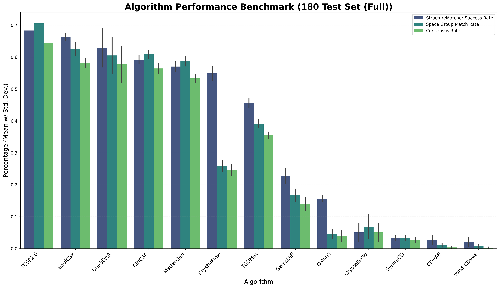
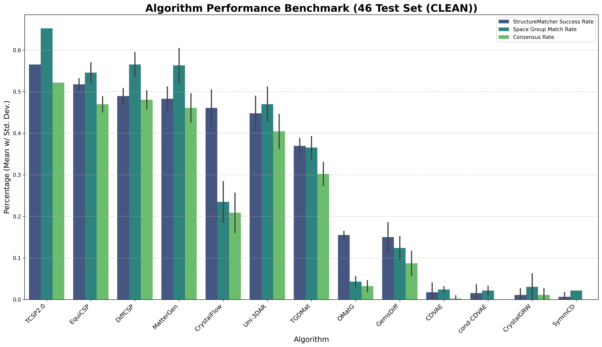
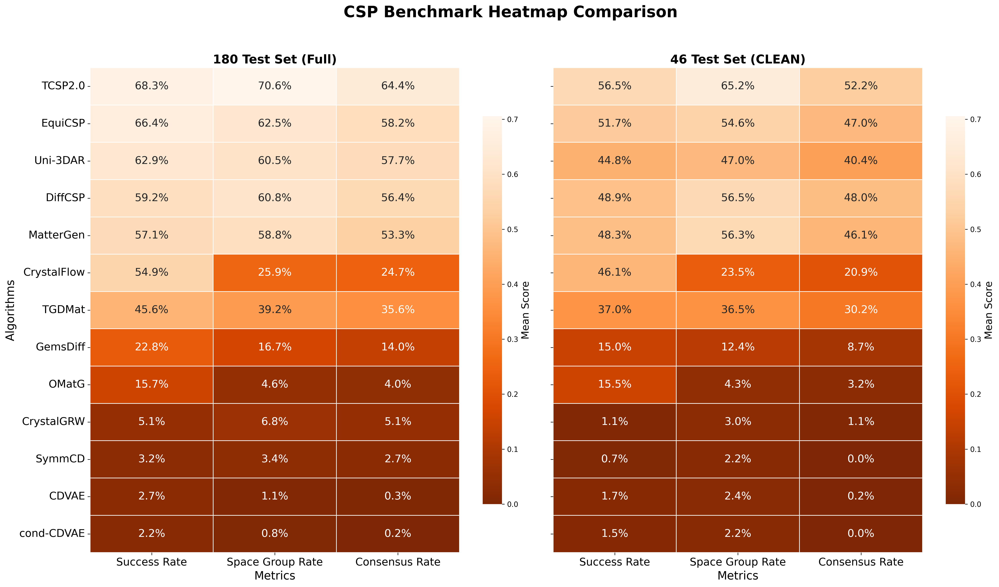

# Deep Learning Crystal Structure Prediction: An Evaluation

Developed by Lai Wei and Dr. Jianjun Hu at [Machine Learning and Evolution Laboratory](http://mleg.cse.sc.edu), University of South Carolina.

**Preprint:** Lai, Wei, Rongzhi Dong, and Jianjun Hu. "Deep Learning Crystal Structure Prediction: An Evaluation." arXiv preprint (2026). [[paper](Link)]

---

## Overview

We present a unified and leakage-controlled benchmark for evaluating deep learning-based crystal structure prediction (CSP) methods under consistent structural matching and symmetry criteria. We systematically assess **12 representative generative models** spanning latent-variable, diffusion, flow-based, and autoregressive paradigms, together with a template-based baseline (TCSP 2.0), across **180 diverse crystal structures** and a rigorously filtered **46-structure CLEAN subset**.

---

## Evaluated Algorithms
Baseline: TCSP 2.0：[link](https://github.com/usccolumbia/TCSP) 

LVA = latent-variable and autoencoder models; DFF = diffusion and flow-based models; ARQ = autoregressive and sequential models.

| Category | Method | Year | Core Innovation / Key Feature | Code |
|----------|--------|------|-------------------------------|------|
| LVA | CDVAE | 2021 | Hybrid VAE-diffusion framework for crystal generation | [link](https://github.com/txie-93/cdvae) |
| LVA | cond-CDVAE | 2024 | Composition-conditioned variational diffusion model | [link](https://github.com/ixsluo/cond-cdvae) |
| DFF | DiffCSP | 2023 | Periodic E(3)-equivariant diffusion for lattice and atoms | [link](https://github.com/jiaor17/DiffCSP) |
| DFF | EquiCSP | 2024 | One-shot SE(3)-equivariant generation via learned bases | [link](https://github.com/EmperorJia/EquiCSP) |
| DFF | GemsDiff | 2024 | Hierarchical diffusion with explicit space-group control | [link](https://github.com/aklipf/gemsdiff) |
| DFF | MatterGen | 2023 | Score-based generation in Cartesian coordinates | [link](https://github.com/microsoft/mattergen) |
| DFF | CrystalFlow | 2024 | Deterministic flow-matching for continuous generation | [link](https://github.com/ixsluo/CrystalFlow) |
| DFF | TGDMat | 2025 | Text-guided joint diffusion for composition and properties | [link](https://github.com/kdmsit/TGDMat) |
| DFF | SymmCD | 2025 | Symmetry-aware conditional diffusion with joint denoising | [link](https://github.com/sibasmarak/SymmCD) |
| DFF | OMatG | 2025 | Stochastic-interpolant framework for CSP | [link](https://github.com/FERMat-ML/OMatG) |
| ARQ | Uni-3DAR | 2025 | Unified autoregressive transformer for crystals and molecules | [link](https://github.com/dptech-corp/Uni-3DAR) |
| ARQ | CrystalGRW | 2025 | Generative random walk for sequential atom placement | [link](https://github.com/trachote/crystalgrw) |


---

## Benchmark Results
 
### Performance on the Full 180-Structure Test Set
 
Evaluation uses Pymatgen's StructureMatcher with `ltol=0.2, stol=0.3, angle_tol=5` and space group tolerance of 10. CHGNet is used as a surrogate potential for structure relaxation prior to comparison. Results reported as mean across ten independent evaluations.
 


| Algorithm | StructureMatcher Rate | Space Group Match Rate | Consensus Rate |
|-----------|----------------------|----------------------|----------------|
| TCSP 2.0 | **68.3%** | **70.6%** | **64.4%** |
| EquiCSP | 66.4% | 62.5% | 58.2% |
| Uni-3DAR | 62.9% | 60.5% | 57.7% |
| DiffCSP | 59.2% | 60.8% | 56.4% |
| MatterGen | 57.1% | 58.8% | 53.3% |
| CrystalFlow | 54.9% | 25.9% | 24.7% |
| TGDMat | 45.6% | 39.2% | 35.6% |
| GemsDiff | 22.8% | 16.7% | 14.0% |
| OMatG | 15.7% | 4.6% | 4.0% |
| CrystalGRW | 5.1% | 6.8% | 5.1% |
| SymmCD | 3.2% | 3.4% | 2.7% |
| CDVAE | 2.7% | 1.1% | 0.3% |
| cond-CDVAE | 2.2% | 0.8% | 0.2% |

### Performance on the 46-Structure CLEAN Subset

The CLEAN subset explicitly excludes structures that may overlap with the training or validation data of publicly released pre-trained models.
 



| Algorithm | StructureMatcher Rate | Space Group Match Rate | Consensus Rate |
|-----------|----------------------|----------------------|----------------|
| TCSP 2.0 | **56.5%** | **65.2%** | **52.2%** |
| EquiCSP | 51.7% | 54.6% | 47.0% |
| DiffCSP | 48.9% | 56.5% | 48.0% |
| MatterGen | 48.3% | 56.3% | 46.1% |
| Uni-3DAR | 44.8% | 47.0% | 40.4% |
| CrystalFlow | 46.1% | 23.5% | 20.9% |
| TGDMat | 37.0% | 36.5% | 30.2% |
| OMatG | 15.5% | 4.3% | 3.2% |
| GemsDiff | 15.0% | 12.4% | 8.7% |
| CDVAE | 1.7% | 2.4% | 0.2% |
| cond-CDVAE | 1.5% | 2.2% | 0.0% |
| CrystalGRW | 1.1% | 3.0% | 1.1% |
| SymmCD | 0.7% | 2.2% | 0.0% |

---

### Heatmap Comparison (Full vs. CLEAN)
 


## Key Findings

- **Template-based TCSP 2.0** achieves the highest overall StructureMatcher success rate (~70%), reflecting strong agreement with known structural prototypes when suitable templates exist.
- **Symmetry-aware equivariant models** (EquiCSP, DiffCSP) demonstrate competitive performance and independent successes beyond template matching, with EquiCSP reaching ~66%.
- **Autoregressive Uni-3DAR** (~63%) shows that sequence modeling can effectively capture long-range crystallographic dependencies.
- **Latent-variable models** (CDVAE, cond-CDVAE) show the lowest StructureMatcher and space-group match rates (<5%), indicating limited effectiveness under standardized evaluation.
- **CLEAN subset results** confirm that performance hierarchies are largely stable under leakage-controlled conditions.

---

## Test Set Details

The 180-structure benchmark spans binary to quaternary compositions, multiple crystal systems, and varying structural complexity. Data is sourced from the Materials Project database.

You can download the full test set: [link](https://github.com/usccolumbia/cspbenchmark/blob/main/data/CSPbenchmark_test_data.csv)


### Data Sample example

| material_id | primitive_formula | full_formula | pretty_formula | nsites | spacegroup | nelements | CrystalSystem | category |
|-------------|-------------------|--------------|----------------|--------|------------|-----------|---------------|----------|
| mp-2334 | DyCu | DyCu | DyCu | 2 | 221 | 2 | Cubic | binary_easy |
| mp-2226 | DyPd | DyPd | DyPd | 2 | 221 | 2 | Cubic | binary_easy |
| mp-1121 | GaCo | GaCo | GaCo | 2 | 221 | 2 | Cubic | binary_easy |
| mp-20132 | InHg | In3Hg3 | InHg | 2 | 166 | 2 | Trigonal | binary_medium |
| mp-2735 | PaO | Pa4O4 | PaO | 2 | 225 | 2 | Cubic | binary_easy |
| mp-13452 | BePd2 | Be2Pd4 | BePd2 | 3 | 139 | 2 | Tetragonal | binary_hard |
| mp-2209 | CeGa2 | CeGa2 | CeGa2 | 3 | 191 | 2 | Hexagonal | binary_medium |

---

## Evaluation Protocol

All evaluations use:
- **Structure matching**: Pymatgen `StructureMatcher` with `ltol=0.2, stol=0.3, angle_tol=5, primitive_cell=True`
- **Space group comparison**: symmetry tolerance of 10
- **Relaxation**: CHGNet universal neural network potential for structure relaxation prior to comparison
- **Metrics**: StructureMatcher Success Rate, Space Group Match Rate, Consensus Rate (SM + SG)
- **Runs**: Mean and standard deviation across 10 independent evaluations

### Evaluation Code

https://github.com/usccolumbia/cspbenchmark/blob/main/eval/success_rates.py

---

## Citation

If you use this benchmark, please cite:

```bibtex

...
```

Please also cite the original CSPBench paper:

```bibtex
@article{wei2024cspbench,
  title={Cspbench: a benchmark and critical evaluation of crystal structure prediction},
  author={Wei, Lai and Omee, Sadman Sadeed and Dong, Rongzhi and Fu, Nihang and Song, Yuqi and Siriwardane, Edirisuriya and Xu, Meiling and Wolverton, Chris and Hu, Jianjun},
  journal={arXiv preprint arXiv:2407.00733},
  year={2024}
}
```

---

## Contact

For questions or support, please contact [lw36@email.sc.edu](mailto:lw36@email.sc.edu) or open an issue on this repository.
